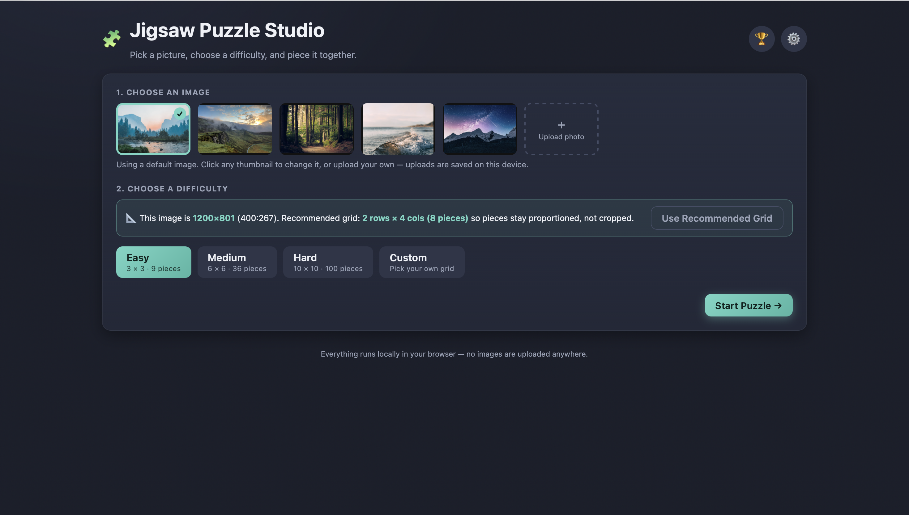
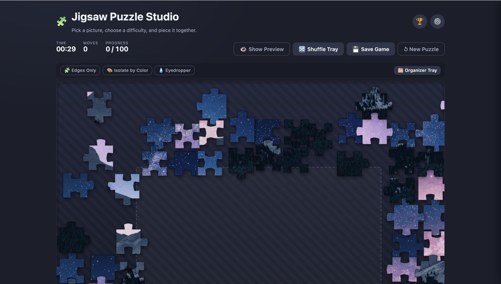
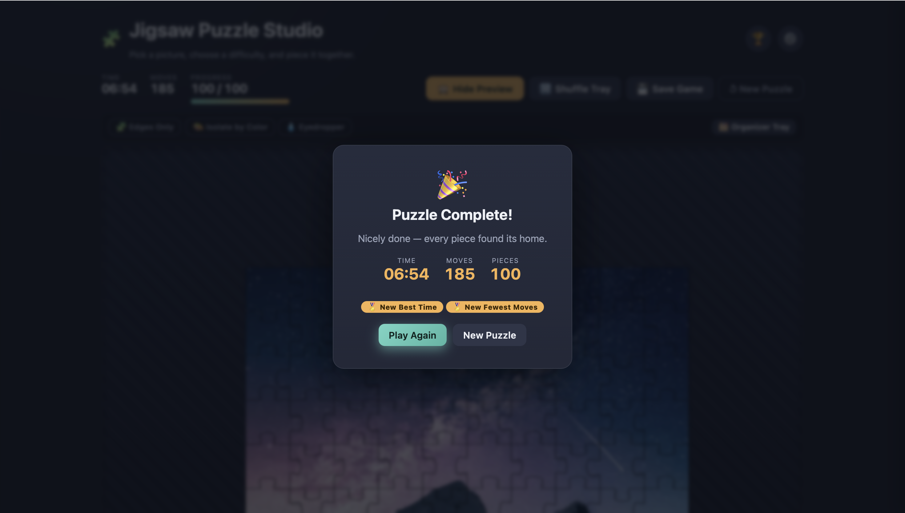

# Jigsaw Puzzle Studio

A browser-based jigsaw puzzle game built with Vanilla JavaScript.

## Features

- Custom image uploads
- Persistent image library
- Save and resume functionality
- Difficulty presets and custom grids
- Piece organizer tray
- Color-based piece filtering
- Edge-piece isolation
- Magnetic piece clustering
- Local records and statistics
- Theme customization

## Screenshots
### Setup Screen

### Gameplay

### Completion Screen

## Technologies

- HTML5
- CSS3
- Vanilla JavaScript
- Canvas API
- IndexedDB
- LocalStorage

## Technical Highlights

### Large Puzzle Optimization

Supports puzzles up to 100×100 pieces.

- Batched puzzle generation
- requestAnimationFrame scheduling
- GPU-accelerated rendering

### Persistent Save System

- IndexedDB save/load
- Automatic save recovery
- Custom image persistence

### Advanced Puzzle Features

- Magnetic piece clustering
- Organizer tray
- Color filtering
- Edge-piece isolation

## Development

This project was developed with assistance from AI tools including Claude for implementation support, brainstorming, and code review.
